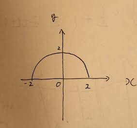
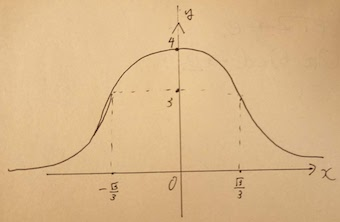

<script type="text/javascript" id="MathJax-script" async src="https://cdn.jsdelivr.net/npm/mathjax@3/es5/tex-chtml.js"></script> 

# 9.数値積分 レポート

## 目的
数値積分のシンプソン則，およびモンテカルロ法について理解する．

## シンプソン則 *Simpson's Rule*
1. **シンプソン則を説明せよ．**  
	シンプソン則とは，関数\\(f(x)\\)を二次関数の集合で近似することで定積分の値の近似値を求める手法である．定積分\\( \int^a_b f(x)\mathrm{d}x\\)は，具体的に次のようにして導出される．
	1. 適当な自然数\\(n\\)を決め，積分区間\\([a,b]\\)を\\(2n\\)等分し，その分割幅を\\(h\\)とする． \\( h=\frac{b-a}{2n} \\) となる．
	2. \\(a\\)から\\(b\\)まで\\(h\\)間隔で引かれる分割線と\\(f(x)\\)の交点を\\(P_0,P_1,P_2...\\)とし，それぞれの座標を\\((x_0, y_0),(x_1, y_1),(x_2,y_2)...\\)とする．それは \\((x_0, f(a)),(x_1,f(a+h)),(x_2,f(a+2h))...\\)と書ける.
	3. \\(P_1\\) が \\(y\\)軸上にくるように，\\(f(x)\\)を\\(x\\)方向に平行移動それを\\(P'_1\\)とする．同様に移動後の点をダッシュをつけて表す．すると\\(P'_0,P'_1, P'_2 \\)の座標はそれぞれ \\((-h,y_0),(0,y_1),(h, y_2)\\) となる．
	4. その3点 \\(P'_0,P'_1, P'_2 \\)を通るような二次関数を \\(y=\alpha x^2+\beta x+\gamma\\) とする．よって \\(P'_0,P'_1, P'_2\\) のそれぞれの\\(y\\)座標：\\(y_0,y_1,y_2\\)は次のように書ける．
		1. \\(\displaystyle y_0 = \alpha h^2-\beta h+\gamma \\)
		2. \\(\displaystyle y_1 = \gamma \\) 
		3. \\(\displaystyle y_2 = \alpha h^2+\beta h+\gamma\\)
		4. (1)式+(3)式より，\\(y_0 + y_2 = 2\alpha h^2 +2\gamma\\)

    ここで\\(S_0 = \int^h_{-h}(\alpha x^2+\beta x+\gamma)\mathrm{d}x \\)を計算すると次のようになる．

	\\(\displaystyle S_0 = \int^h_{-h}(\alpha x^2+\beta x+\gamma)\mathrm{d}x \\)  
	\\(\displaystyle = \left[ \frac{1}{3}\alpha x^3+\frac{1}{2}\beta  x^2 + \gamma x \right]^h_{-h} \\)  
	\\(\displaystyle = 2\left[ \frac{1}{3}\alpha x^3+x^2 + \gamma x \right]^h_{0} \\)  
	\\(\displaystyle = 2(\frac{1}{3}\alpha h^3 + \gamma h) \\)  
	\\(\displaystyle = \frac{h}{3}(2\alpha h^2 + 6\gamma ) \\)  
	\\(\displaystyle = \frac{h}{3}(2\alpha h^2 + 2\gamma + 4\gamma ) \\)  
	4式より  
	\\(\displaystyle = \frac{h}{3}(y_0+y_2+4y_1) \\)
	\\(\displaystyle = \frac{h}{3}(y_0+4y_1+y_2)\\)  

    同様に\\(P_2\\)が\\(y\\)軸上に来るように\\(x\\)軸方向に平行移動した時の\\(S_1\\)の面積も \\(S_1=\frac{h}{3}(y_2+4y_3+y_4)\\)と書ける．
    
    よって，  
    \\(\displaystyle \int^b_af(x)\mathrm{d}x \approx \sum\limits^N_{n=1}S_n \\)  
    \\(\displaystyle = \frac{h}{3}(y_0+4y_1+y_2) + \frac{h}{3}(y_1+4y_2+y_3) +... + \frac{h}{3}(y_{2n-2}+4y_{2n-1}+y_{2n})\\)   
    \\(\displaystyle = \frac{h}{3}[(y_0 +y_{2n}) + 4(y_1+y_3+...+y_{2n-1})+2(y_2+y_4+...+y_{2n-2})] \\)
となる．

2. **シンプソン則により，\\( \int^2_0 \sqrt{4-x^2}\mathrm{d}x \\) を計算せよ．**  
	| Partitions(n) | Simpson's rule |       Error |
	| ------------: | -------------: | ----------: |
	|            50 |     3.14113307 |  0.00045967 |
	|           100 |     3.14143109 |  0.00016165 |
	|           500 |     3.14157701 |  0.00001574 |
	|          1000 |     3.14158750 |  0.00000525 |
	|          2000 |     3.14159131 |  0.00000143 |
	|          5000 |     3.14159203 |  0.00000072 |
	|         10000 |     3.14159203 |  0.00000072 |
	|         20000 |     3.14159369 | -0.00000095 |


3. **表から分かること**  
- \\(n=50\\)から \\(n=100\\)にになった時は真値との誤差は1/3となったが，\\(n=5000\\)から \\(n=10000\\)となった時には誤差の減少は見られず，\\(n\\)が大きくなるにつれ，誤差の減少幅が小さくなっていくことがわかる．

4. **プログラム**
	``` C
	#include <stdio.h>
	#include <math.h>

	#define f(x) sqrt(4 - pow(x, 2))

	int main(void)
	{
		float a = 0, b = 2;
		float h;
		float s = 0.0, s0 = 0.0, s1 = 0.0;
		float pi = 3.14159265;
		int n;

		scanf("%d", &n);
		h = (b - a) / (2 * n);
		s = f(a) + f(b);

		for (int i = 1; i <= (2 * n - 1); i += 2)
		{
			s0 += f(a + h * i);
		}
		for (int i = 2; i <= (2 * n - 2); i += 2)
		{
			s1 += f(a + h * i);
		}
		s = h * (s + 4 * s0 + 2 * s1) / 3;

		printf("RESULT : %.8f\n", s);
		printf("ERROR : %.8f\n", pi - s);
		return 0;
	}
	```

5. **グラフ描画**  
	\\( \displaystyle y = \sqrt{4-x^2} \\)とする．そのため\\(x\\)の定義域は\\(-2\leq x \leq 2\\),値域は\\(0 \leq y \leq 2 \\)である．また， 変形すると\\(x^2+y^2=4\\)であるためこれは半径2の円の方程式である．よって図示すると次のようになる．

	


6. **積分の手計算**
	1. 置換積分 
		\\(\displaystyle \int^2_0\sqrt{4-x^2}\mathrm{d}x \ \ \ \ \ \\)  [ \\(x=2\sin\theta\\) と置換．]  
		\\(\displaystyle = \int^\frac{\pi}{2}_0\sqrt{4-2^2\sin^2{\theta}}\cdot2\cos{\theta}\mathrm{d}\theta \\)  
		\\(\displaystyle = 4\cdot\int^\frac{\pi}{2}_0\cos^2{\theta}\mathrm{d}\theta \\)  
		\\(\displaystyle = 4\cdot\int^\frac{\pi}{2}_0\frac{1+\cos{2\theta}}{2}\mathrm{d}\theta \\)  
		\\(\displaystyle = 2\cdot\left[\theta+\frac{1}{2}\sin{2\theta}\right]^\frac{\pi}{2}_0 \\)
		\\(\displaystyle = 2\cdot\frac{\pi}{2} = \pi \\)

	2. 部分積分を適用  
		\\(\displaystyle \int^2_0\sqrt{4-x^2}\mathrm{d}x\ \ \ \ \  \\)    [ \\( 1\cdot \sqrt{4-x^2}\\)とし部分積分 ]  
		\\(\displaystyle = \left[ x\sqrt{4-x^2}\right]^2_0- \int^2_0\frac{1}{2} x \frac{-2x}{\sqrt{4-x^2}}\mathrm{d}x\\)  
		\\(\displaystyle = \int^2_0 \frac{x^2}{\sqrt{4-x^2}}\mathrm{d}x\ \ \ \ \ \ \ \\) [ \\(x=2\sin\theta\\) と置換]    
		\\(\displaystyle = \int^{\frac{\pi}{2}}_0 \frac{4\sin^2\theta}{\sqrt{4-4\cos^2\theta}}2\cos\theta\mathrm{d}\theta \\)  
		\\(\displaystyle = 4\int^{\frac{\pi}{2}}_0 \frac{1-\cos2\theta}{2}\mathrm{d}\theta \\)  
		\\(\displaystyle = 2\left[ \theta - \frac{1}{2}\sin2\theta\right]^{\frac{\pi}{2}}_0 = 2(\frac{\pi}{2})=\pi\\)
	
7. **シンプソン則を利用して\\(\int^1_0\frac{4}{1+x^2}\mathrm{d}x\\)を求めよ．**

	| Partitions(n) | Simpson's rule |       Error |
	| ------------: | -------------: | ----------: |
	|            50 |     3.14159274 |  0.00000000 |
	|           100 |     3.14159274 |  0.00000000 |
	|           500 |     3.14159274 |  0.00000000 |
	|          1000 |     3.14159274 |  0.00000000 |
	|          2000 |     3.14159274 |  0.00000000 |
	|          5000 |     3.14159322 | -0.00000048 |
	|         10000 |     3.14159179 |  0.00000095 |
	|         20000 |     3.14159203 |  0.00000072 |

8. **グラフ描画**  
	\\(\displaystyle y = \frac{4}{1+x^2}\\)とし，\\(y'=0\\), \\(y''=0\\) となるような\\(x\\)を求めると，それぞれ


	\\(\displaystyle y' = \frac{-8x}{(1+x^2)^2} = 0\\) すなわち \\(x=0\\)，  
	\\(\displaystyle y'' = \frac{8(3x^2-1)}{(1+x^2)^3} = 0\\) すなわち \\(x=\pm\frac{\sqrt{3}}{3}\\)となる．増減表を描くと次のようになる．  

	|  \\(x\\)  |  \\(\cdots\\)  | \\(-\frac{\sqrt{3}}{3}\\) |  \\(\cdots\\)  |     \\(0\\)      |  \\(\cdots\\)  | \\(+\frac{\sqrt{3}}{3}\\) |  \\(\cdots\\)  |
	| :-------: | :------------: | :-----------------------: | :------------: | :--------------: | :------------: | :-----------------------: | :------------: |
	| \\(y''\\) |   \\(\cup\\)   |             0             |   \\(\cap\\)   |    \\(\cap\\)    |   \\(\cap\\)   |             0             |   \\(\cup\\)   |
	| \\(y'\\)  | \\(\nearrow\\) |      \\(\nearrow\\)       | \\(\nearrow\\) |        0         | \\(\searrow\\) |      \\(\searrow\\)       | \\(\searrow\\) |
	|  \\(y\\)  |  \\(\cdots\\)  |     \\(3\\) (変曲点)      |  \\(\cdots\\)  | \\(4\\) (極大値) |  \\(\cdots\\)  |     \\(3\\)  (変曲点)     |  \\(\cdots\\)  |

	

9. **定積分の手計算**  
	\\(\displaystyle \int^4_0 \frac{4}{1+x^2} \ \ \ \ \  \\)  [\\( x=\tan\theta\\) と置換．\\(\mathrm{d}x = \frac{1}{\cos^2\theta}\mathrm{d}\theta\\)]  
	\\(\displaystyle = \int^{\frac{\pi}{4}}_0 \frac{1}{1+\tan^2\theta} \frac{1}{\cos^2\theta} \mathrm{d}\theta  \\)  
	\\(\displaystyle = 4 \int^{\frac{\pi}{4}}_0 1 \mathrm{d}\theta \\)   
	\\(\displaystyle = 4 \left[\theta \right]^{\frac{\pi}{4}}_0 \\)  
	\\(\displaystyle = \pi \\)  

## シンプソン3/8則 *Simpson's 3/8 Rule*
10. **シンプソン3/8則を利用して \\(\int^2_0\sqrt{4-x^2}\mathrm{d}x\\) を求めよ．**


	| Partitions(n) | Simpson's rule |      Error |
	| ------------: | -------------: | ---------: |
	|            50 |     3.10319471 | 0.03839803 |
	|           100 |     3.13569856 | 0.00589418 |
	|           500 |     3.14037108 | 0.00122166 |
	|          1000 |     3.14140511 | 0.00018764 |
	|          2000 |     3.14144015 | 0.00015259 |
	|          5000 |     3.14155531 | 0.00003743 |
	|         10000 |     3.14158630 | 0.00000644 |
	|         20000 |     3.14158630 | 0.00000644 |

11. **シンプソン3/8則を利用して\\(\int^1_0\frac{4}{1+x^2}\mathrm{d}x\\) を求めよ．**

	| Partitions(n) | Simpson's rule |      Error |
	| ------------: | -------------: | ---------: |
	|            50 |     3.05935979 | 0.08223295 |
	|           100 |     3.12141728 | 0.02017546 |
	|           500 |     3.13357043 | 0.00802231 |
	|          1000 |     3.13959169 | 0.00200105 |
	|          2000 |     3.13959098 | 0.00200176 |
	|          5000 |     3.14079309 | 0.00079966 |
	|         10000 |     3.14139318 | 0.00019956 |
	|         20000 |     3.14139247 | 0.00020027 |


## モンテカルロ法
12. 提出不要
13. **モンテカルロ法により楕円 \\(\frac{x^4}{2}+y^2=1\\) の面積を求めよ．**

	```C
	#include <stdio.h>
	#include <stdlib.h>
	#define NUM 10000000

	double rnd(double n){
		return ( (double)rand()/RAND_MAX*n);
	}

	int main(void){
		double x, y, pi;
		int i, in=0;
		for(i=0; i<NUM; i++){
			x = rnd(2);
			y = rnd(1);
			if (x*x/4 + y*y <= 1) {
				in++;
			}
		}
		printf("S = %f\n", 8.0 * in /NUM);
		return 0;
	}
	```

	結果は`S = 6.283756`だった．この楕円の長軸の長さは2, 単軸の長さは1のため，面積Sは正確には \\(S=2\cdot1\cdot\pi=2\pi\\)となる．
14. **モンテカルロ法により次の定積分が示す面積を求めろ．**
    1. \\(\int^1_0(x^2+x+1)\mathrm{d}x\\)
		
		```C
			#include <stdio.h>
			#include <stdlib.h>
			#include <math.h>
			
			#define NUM 10000000
			#define f(x) ((x)*(x) + (x) + 1)

			double rnd(double n){
				return ( (double)rand()/RAND_MAX*n);
			}

			int main(void){
				double x, y, pi;
				int i, in=0;

				for(i=0; i<NUM; i++){
					x = rnd(1);
					y = rnd(3);
					if (y <= f(x) ) {
						in++;
					}
				}
				printf("S = %f\n", 3.0 * in /NUM);
				return 0;
			}
		```

		結果は`S = 1.834006`となった．この定積分の真値は \\(\frac{11}{6}=1.8\dot{3}\\)である．

	2. \\(\int^2_0\sqrt{4-x^2}\mathrm{d}x\\)
		```C
		#include <stdio.h>
      	#include <stdlib.h>
      	#include <math.h>

      	#define NUM 10000000
      	#define f(x) sqrt(4 - pow(x, 2))

      	double rnd(double n){
      		return ( (double)rand()/RAND_MAX*n);
      	}

      	int main(void){
      		double x, y, pi;
      		int i, in=0;
      		double x_range = 2.0;
      		double y_range = 2.0;
      		for(i=0; i<NUM; i++){
      			x = rnd(x_range);
      			y = rnd(y_range);
      			if (y <= f(x) ) {
      				in++;
      			}
      		}
      		printf("S = %f\n", x_range * y_range * in /NUM);
      		return 0;
      	}
		```
		結果は`S = 3.141878`となった．この定積分の真値は\\(\pi\\)である．  
	3. \\(\int^1_0\frac{4}{1+x^2}\mathrm{d}x\\)  
		```C
		#include <stdio.h>
		#include <stdlib.h>
		#include <math.h>

		#define NUM 10000000
		#define f(x) (4 / (1 + (x) * (x)))

		double rnd(double n){
			return ( (double)rand()/RAND_MAX*n);
		}

		int main(void){
			double x, y, pi;
			int i, in=0;
			double x_range = 1.0;
			double y_range = 4.0;
			for(i=0; i<NUM; i++){
				x = rnd(x_range);
				y = rnd(y_range);
				if (y <= f(x) ) {
					in++;
				}
			}
			printf("S = %f\n", x_range * y_range * in /NUM);
			return 0;
		}
		```

		結果は`S = 3.142066`となった．この定積分の真値は\\(\pi\\)である．


# 考察
	
今回シンプソン則とモンテカルロ法の2種類の数値積分の方法を試した．シンプソン則に関しては十分大きな繰り返し数をとれば`float`型で表現される範囲では十分に正確な値に近づくことがわかった．またモンテカルロ法も，非常にシンプルな手法であり実装も比較して簡単だと感じた．一方今回は乱数の数を \\( 10\exp6\\)で固定したため，回数による変化は分からなかったが，その性質から乱数の個数を増やせば増やすほど精度が上がると考えられる．
	


